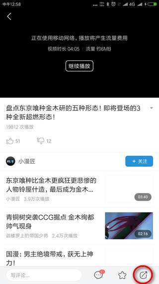
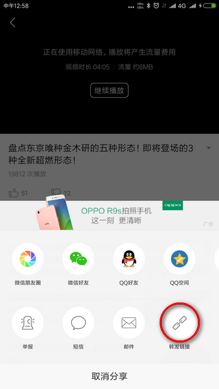
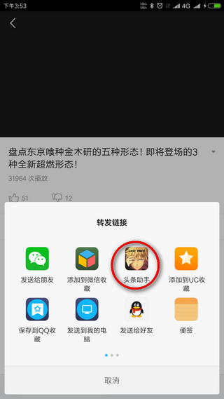
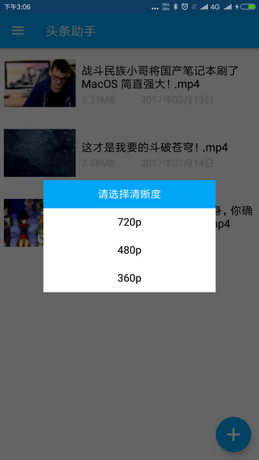
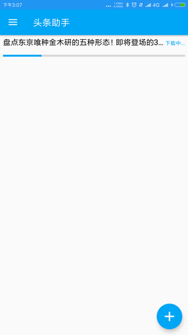
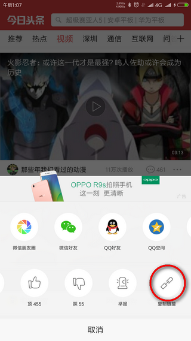
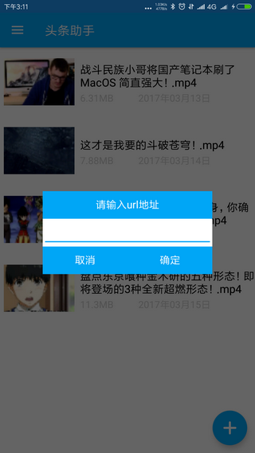

#一、简述
##1、功能
今日头条助手主要提供视频下载和文章图片收集功能，支持安卓app和PC端网页。
	
- 安卓app:
>可以通过今日头条APP的分享功能进行文件下载。
>可以通过今日头条APP复制文章连接进行文件下载。

- PC端网页：
>可以通过复制网页url，粘贴到本应用url输入框中进行下载。

##2、侧边栏：

- 视频列表：显示、管理下载过的视频
- 图片列表：查看下载过的图片
- 下载管理：管理当前正在下载文件（支持断点续传）
- 说明：本文说明
- 关于：作者信息

###3、Demo下载
[DemoApp下载](app-release.apk)

#二、使用方式 
使用方式有以下两种：

- [1、app分享方式](#app分享方式)
- [2、手动输入url方式](#手动输入url方式)

以下以视频为例（图片操作一样）

##app分享方式

1、在文章界面，点击右下角的“分享”按钮。

2、点击“转发链接”。

3、点击“今日头条助手”。

4、等待应用获取文件链接。

5、选择视频清晰度。（图片下载没有这一步）

6、从侧边栏进入“下载管理”界面，可以看见正在下载的文件（可暂停）。

7、从侧边进入“视频列表”界面，可以看到刚刚下载的文件（图片则到“图片列表”界面查看）。

##手动输入url方式

1、今日头条中的视频一栏，看到你想要下载的视频时，点击对应视频item的右下角“更多”按钮。

2、点击“复制链接”。

3、打开“今日头条助手”，点击右下角的“+”号按钮，粘贴进去刚才复制的url即可。

